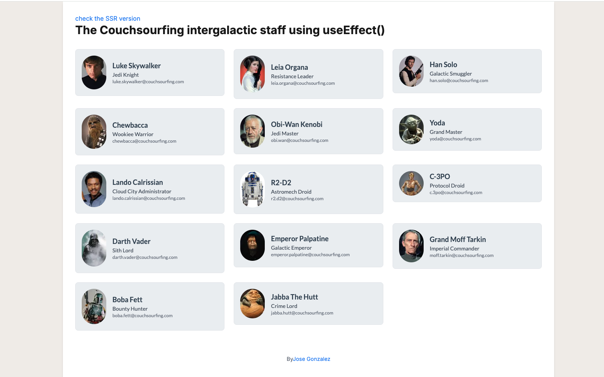

This is my excersise for couchsourfing


I wanted to show both client side render and server side render, so I created a separate page for each. 
Notice how the good guys are friends of the good guys and the villians with the villians. 




## Getting Started

First, run the development server:

```bash
npm run dev
```

Open [http://localhost:3000](http://localhost:3000) with your browser to see the result.


